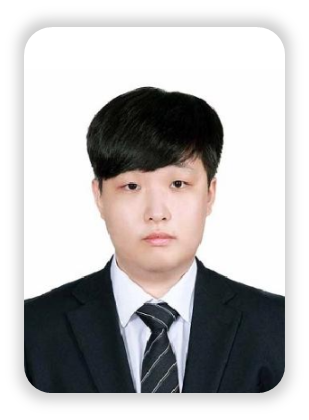

# 공유사이

 

## 프로젝트 소개
**공유사이**

 

## 목차
- [참여자](#참여자)
- [느낀점](#느낀점)
- [발표자료](#발표자료)
- [UCC](#UCC)
- [기간](#기간)
- [기능구현](#기능구현)
- [사용기술스택](#사용기술스택)
- [스크린샷](#스크린샷)

 

## 참여자

### Back-end

| 한상우([@miracle3070](https://github.com/miracle3070)) | 정명관([@rhalsemd](https://github.com/rhalsemd)) | 김지현([@potatohyun](https://github.com/potatohyun)) |
|:----:|:----:|:----:|
||||

 

### Front-end

| 이주형([@22JH](https://github.com/22JH)) | 한승준([@hanseungjune](https://github.com/hanseungjune)) | 김태헌([@gangnamssal](https://github.com/gangnamssal)) |
|:----:|:----:|:----:|
||||

 

## 느낀점

### 한상우

### 정명관

### 한승준

### 이주형

### 김태헌

### 김지현

 

## 발표자료

 

## UCC

 

## 기간
2023.04.10. ~ 2023.05.19.

 

## 기능구현

- Back-end
    - 
- Front-end
    - 
- Blockchain
    - Kakao Klaytn을 활용한 자동차 히스토리 내역을 블록체인화 하여 기록 및 정보제공
- Infra
    - Jenkins(Java 17), Docker, Docker-Compose를 활용하여 Merge Request WebHook 발생시 빌드 및 배포
    - Jenkins Pipeline 활용 및 SSH 원격서버 제어, CURL 이용한 배포완료 메세지 전송
    - 

 

## 사용 기술스택

 

## 스크린샷

 